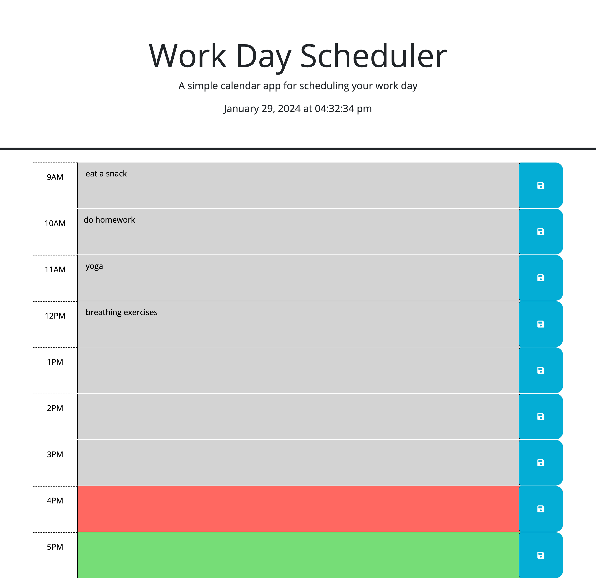

# Workday-Scheduler

## Description

- The purpose of this this challenge was to create a simple workday schedule that allows the user to save what tasks they plan to do for the day. Although this challenge only had me create time blocks for the standard 9-5 workday hours, this small assignment still had its challenges. Especially when it came to local storage, I realized how tricky it can be for me to know how to properly retrieve data depending on the type of data. I also realized how important local storage is and how it is heavily relied on by users to store their data so that they may be able to refer to it for future use.

## Installation

N/A

## Usage
- The way to use this application is fairly simple. User will add their tasks for the day and will be able to refer to it as needed. The timeblocks also change color depending on if a task has passed its hour block, currently going on, or if it is yet to come.

  GitHub page: https://noe-bee.github.io/workday-scheduler/   
  GitHub repository: https://github.com/noe-bee/workday-scheduler

 

## Credits

N/A

## License

Refer to the license on the repository.

---
